# System Design Fundamentals - Day 1

This README covers the fundamental concepts of System Design, based on Day 1 of daily commits.

## 1. IP Address
A computer introduces itself to others on the internet using an IP address. There are two types: IPv4 and IPv6. Every system in the network has a unique IP address.

Example: A laptop and a phone each have their own IP, like house addresses on a street.

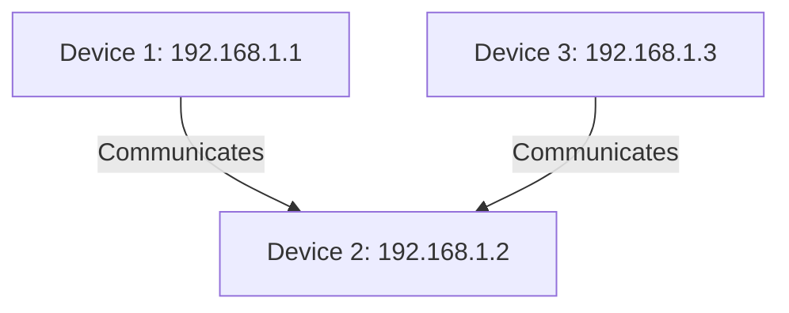

## 2. DNS (Domain Name System)
When we type the name of a service, it connects to the server running that service using DNS, which acts like a directory or phonebook. The DNS server has records, stores them in cache, and retrieves the IP of the server. Now we can access the server running our application.

Example: Like using a phonebook to turn a website name into the server's number.

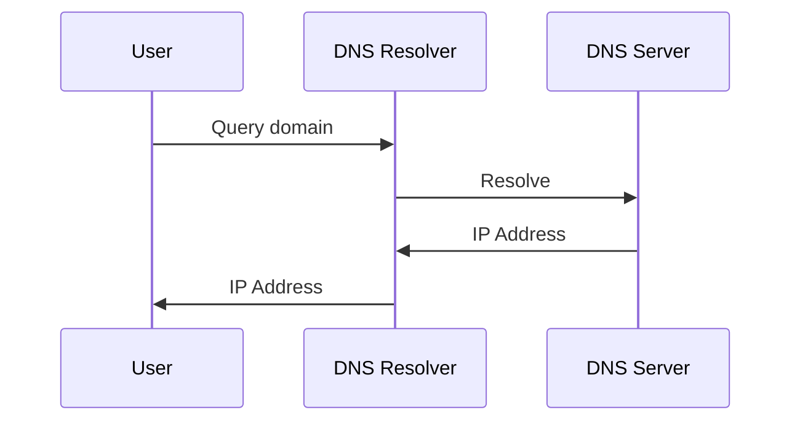

## 3. Cloud Computing
Instead of buying and maintaining servers yourself, rent them from companies with huge data centers full of ready-to-use servers.

### Benefits:
- **Scalability**: Scale up/down, in/out based on visitors.
- **Cost-Effective**: Pay-as-you-go.
- **Reliability**: Maintain server uptime with backups.

Example: Like renting a warehouse with shelves already set up, instead of building your own storage.

Cloud computing shifts focus from hardware to building business.

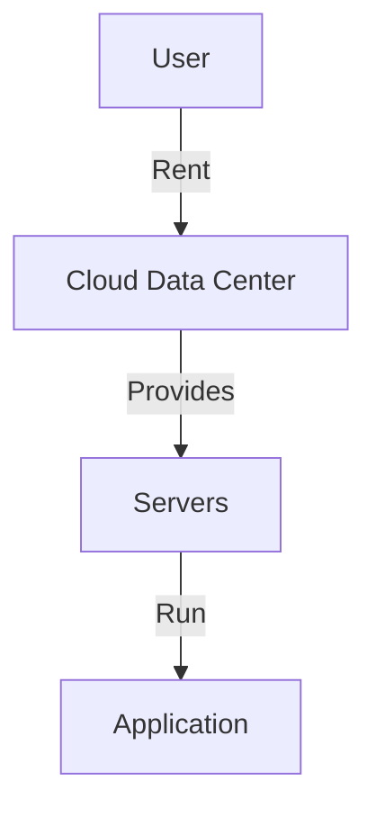

## 4. Client & Server Relationship
- **Client**: A device that requests information.
- **Server**: A computer that serves the requested information.

Example: Like a customer ordering food and a kitchen preparing and sending the dish.

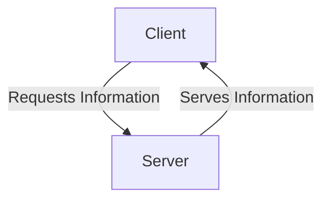

## 5. Protocols
Computers follow rules (protocols) for communication, varying by task.

Example: Like traffic lights and road rules that help cars move safely.

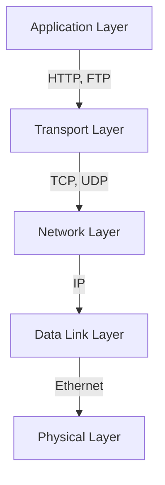

## 6. TCP (Transmission Control Protocol)
Ensures data packets are received in the correct sequence with acknowledgments.

Example: Like sending important letters with delivery receipts to confirm arrival.

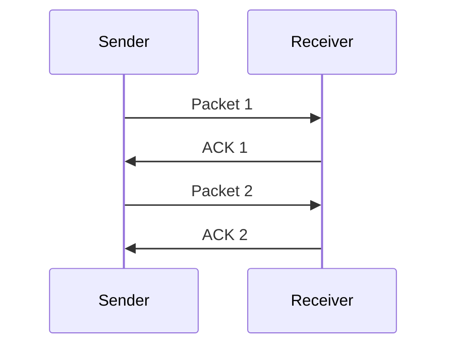

## 7. UDP (User Datagram Protocol)
Used for live telecasting; sends data packets at high speed but may skip some, without guaranteed delivery.

Example: Like live news video where speed is more important than perfect delivery.

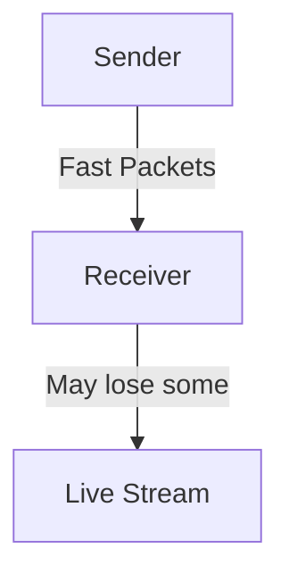

## 8. HTTP (Hyper Text Transfer Protocol)
Back-and-forth conversation between client and server. One-directional: server responds only to client requests.

Example: Like asking a waiter for a dish and waiting for the menu response.

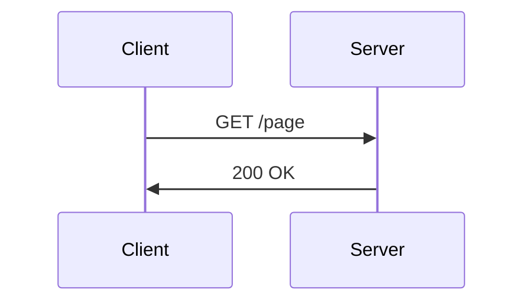

## 9. Web Sockets
Bi-directional: both client and server can send information anytime. Enables real-time, efficient conversations (e.g., AI chatbots).

Example: Like a chatroom where either side can speak whenever they want.

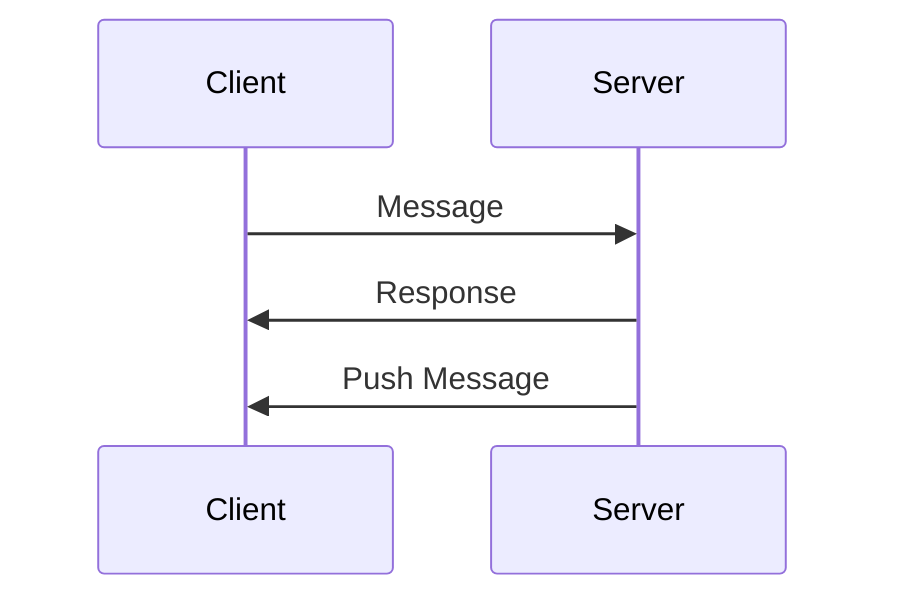

## 10. Forward Proxy
Acts as a personal assistant for the computer. Requests go through the proxy, which retrieves data from the internet.

Example: Like asking a helper to fetch a book from the library for you.

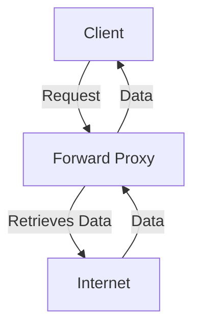

## 11. Reverse Proxy
Acts as a personal assistant for servers. Filters and forwards appropriate requests to servers.

Example: Like a receptionist who sends visitors to the right department.

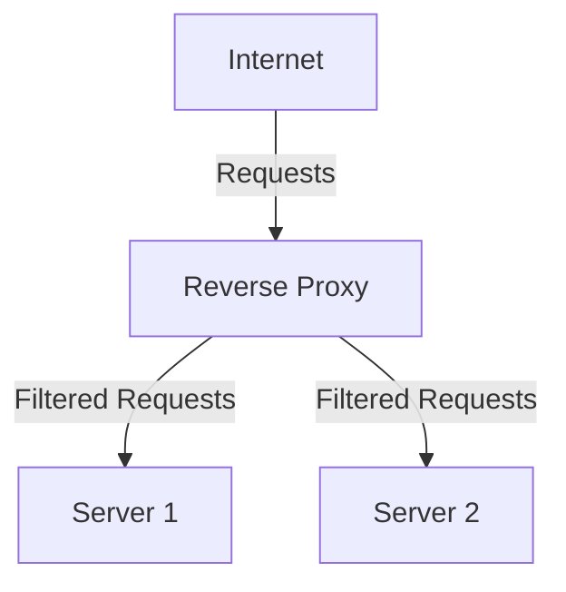

## 12. API (Application Programming Interface)
APIs allow computers to communicate, similar to human social interactions. Types: REST, GraphQL, gRPC.

Example: Like a waiter carrying a customer's request to the kitchen.

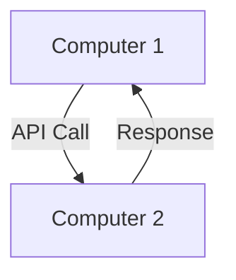

## 13. REST API
Has standards for requests: GET (retrieve), POST (add), PATCH (update), DELETE (remove).

Example: Like ordering from a menu with fixed choices.

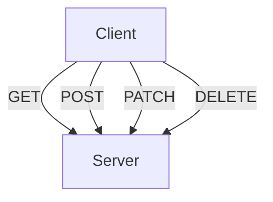

## 14. GraphQL
Allows customized queries in a single request, unlike REST's fixed options.

Example: Like ordering a custom pizza with exactly the toppings you want.

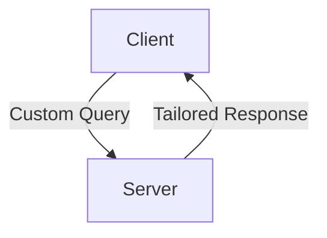

## 15. gRPC
Uses efficient "Protocol Buffers" for fast communication between services.

Example: Like using shorthand codes between staff so messages travel faster.

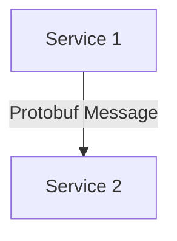

## 16. Message Queue
Producer adds tasks (messages) to a queue; consumer processes them asynchronously.

Example: Like leaving a task list for a helper to complete one by one.

### Benefits:
- Efficiency: Producer can work on other tasks.
- Management: No tasks forgotten.
- Reliability: All tasks completed.

### Disadvantages:
- Overcomplicating simple tasks.
- Delays for urgent tasks.

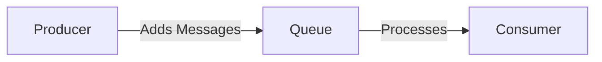

## 17. Scalability
System's ability to handle growing demand smoothly. Types: Scale-In/Out.

Example: Like opening more cashiers during a shopping rush.

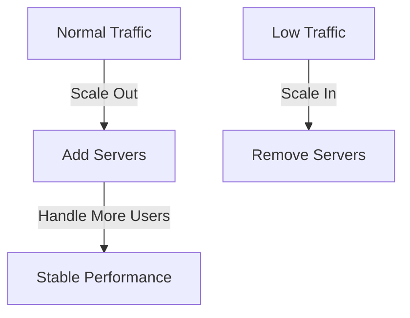

## 18. Availability
Uptime percentage, measured in "nines" (e.g., 99.999% = 5 nines, ~5 min downtime/year).

Example: Like a store open 24/7 so customers can visit anytime.

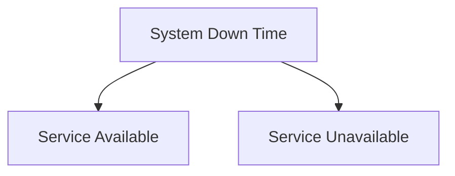
## 19. Consistency
- **Strong Consistency**: Same data visible immediately (e.g., bank transactions).
- **Eventual Consistency**: Data consistent over time (e.g., social media posts).

Example: Like all students seeing the same announcement right away (strong) versus a message that reaches some later (eventual).

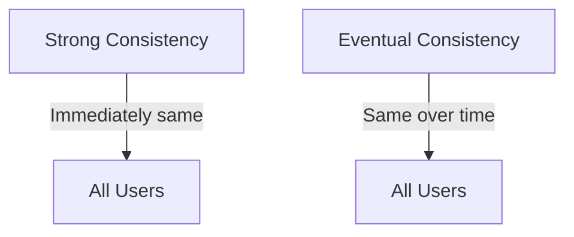

## 20. Single-Point-Of-Failure (SPOF)
Avoid SPOF with redundancy for fault tolerance.

Example: Like using two power lines instead of one so one failure does not shut down the house.

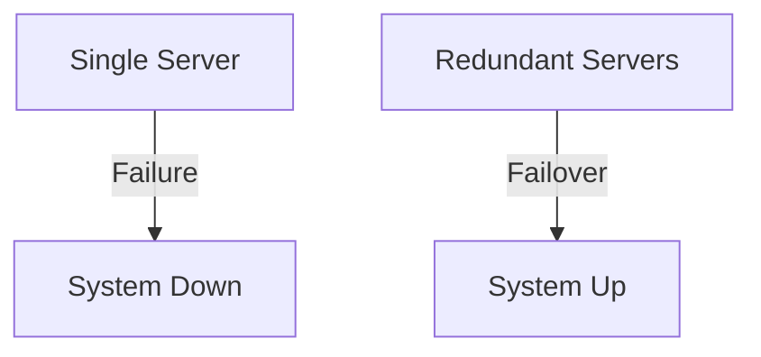

## 21. SQL/Relational DB
Structured data in tables (rows/columns). Examples: MySQL, PostgreSQL.

Example: Like a spreadsheet where each row is a record and columns are fields.

```mermaid
erDiagram
    CUSTOMER ||--o{ ORDER : places
    ORDER ||--|{ LINE-ITEM : contains
```

## 22. NoSQL DB
Handles unstructured data in flexible formats (e.g., JSON). Types: Key-Value, Document, Graph, Wide-Column, Time-Series. Examples: MongoDB, Cassandra, DynamoDB.

Example: Like a row of boxes where each box can hold different items.

```mermaid
graph TD;
    A[Document] -->|JSON| B[Flexible Data];
    B -->|Key-Value| C[Fast Access];
    B -->|Graph| D[Relationships];
```

## 23. Choosing SQL vs NoSQL
- **SQL**: Fixed structure, complex queries, ACID compliance.
- **NoSQL**: Fast access, large volumes, horizontal scaling, flexible/evolving data.

Example: Use SQL when your data is like a fixed form; use NoSQL when data changes often or is unstructured.

```mermaid
graph TD;
    A[Data Structure] -->|Fixed| B[SQL];
    A -->|Flexible| C[NoSQL];
    D[Query Type] -->|Complex Joins| B;
    D -->|Simple Lookup| C;
    E[Scale] -->|Vertical| B;
    E -->|Horizontal| C;
```

## 24. Object Storage
Stores large files like photos, videos, music.

Example: Like a storage locker where each object is saved with metadata and can be retrieved later.

```mermaid
graph TD;
    A[Bucket] -->|Photos| B[Object 1];
    A -->|Videos| C[Object 2];
    A -->|Music| D[Object 3];
```

## 25. CDN (Content Delivery Network)
Stores copies of static content (images, videos) on nearby servers to reduce latency.

Example: Like a local shop holding popular items so customers do not travel far to the main warehouse.

```mermaid
graph TD;
    A[User in India] -->|Request| B[CDN Server (Nearby)];
    B -->|Return Cached Content| A;
    B -->|If miss| C[Origin Server (London)];
    C -->|Send Content| B;
```
## 26. Cache
Fast memory for frequently accessed data, 50-100x faster than DB.

Example: Like keeping snacks on your desk instead of walking to the kitchen each time.

### Strategies:
- **Cache Aside**: Check cache; if miss, query DB and update cache.
- **Read Through**: Cache queries DB on miss.

```mermaid
graph TD;
    A[User] -->|Query| B{Cache};
    B -->|Hit| C[Return Data];
    B -->|Miss| D[Query DB];
    D -->|Data| E[Update Cache];
    E -->|Data| C;
```

## 27. Logging
Records key activities like a diary for debugging issues.

Example: Like writing down important events so you can review them later.

```mermaid
graph TD;
    A[Server] -->|Logs Events| B[Log File];
    B -->|Review| C[Developer];
```

## 28. Monitoring
Watches logs like a security camera, triggering alerts for issues.

Example: Like a security guard watching cameras and calling for help when a problem appears.

Together, logging and monitoring keep systems healthy.


```mermaid
graph TD;
    A[Logs] -->|Watches| B[Monitoring System];
    B -->|Alert| C[Developer];
```