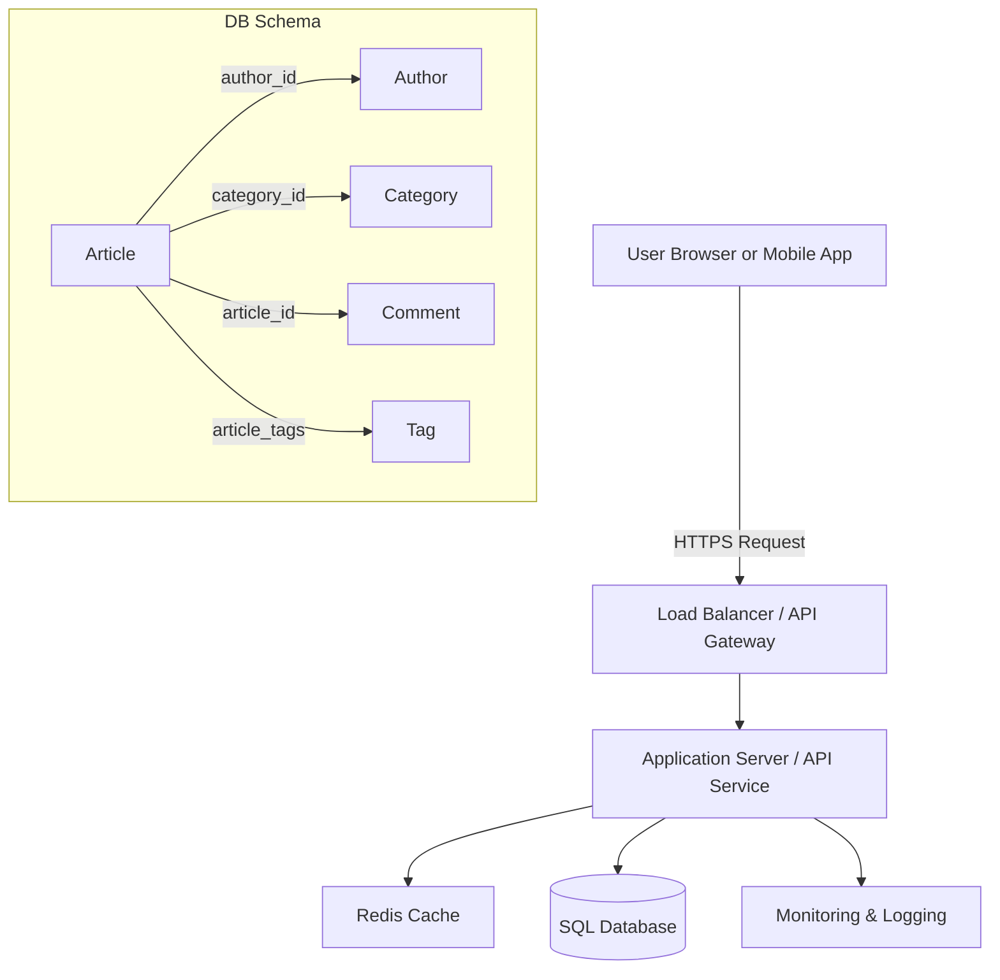

# System Design Practice - Day 2

This README presents a sample system design for an **Article Publishing Platform**. It is a Day 2 prerequisite summary for system design preparation. It covers functional requirements, non-functional requirements, API design, core entities, a high-level architecture diagram, and optimization decisions.

## 1. Functional Requirements (FR)
- FR1: Users can browse a list of published articles.
- FR2: Users can view article details by article ID.
- FR3: Users can search and filter articles by title, author, category, or tag.
- FR4: The system supports pagination for article listing and search results.
- FR5: Administrators can create, update, and delete articles.
- FR6: Users can add comments to articles.
- FR7: The system returns summary metadata for articles, including author name, publish date, and tags.

## 2. Out of Scope (FR)
- Auth: User authentication and authorization are intentionally out of scope for this design. We assume an upstream auth service or API gateway handles identity.
- Payment: Subscription billing, payments, and monetization flows are out of scope.
- Social login and OAuth flows are out of scope.
- Real-time collaboration or live editing is out of scope.
- Media upload and CDN management for large files are out of scope.

## 3. Non-Functional Requirements (NFR)
- NFR1: Performance should allow article list requests to respond in under 200ms for common page sizes.
- NFR2: Scalability should support growth from thousands to millions of daily readers.
- NFR3: Availability should target 99.9% uptime for read operations.
- NFR4: Consistency should ensure article updates are visible quickly across reads.
- NFR5: Maintainability should allow developers to deploy updates with minimal downtime.
- NFR6: Observability should provide metrics and logs for request latency, error rates, and database performance.
- NFR7: Security should ensure data is protected in transit and at rest.

## 4. Out of Scope (NFR)
- Fault tolerance across multiple regions is out of scope for this version.
- Backup and disaster recovery are not included in this initial design.
- Strong encryption key management and advanced compliance controls are out of scope.
- Offline support and client-side synchronization are out of scope.

## 5. Core Entities of the System
- Article
- Author
- Category
- Tag
- Comment
- ArticleVersion (optional for audit/history)

## 6. API Design (REST)
The system uses a REST API because it is simple for content CRUD and pagination. GraphQL could be added later for more flexible nested queries, while gRPC is better suited for internal microservice communication.

### Primary API Routes
- `GET /articles?page=1&limit=10`
- `GET /articles?search=cloud&author=alice&page=1&limit=20`
- `GET /articles/:articleId`
- `POST /articles`
- `PATCH /articles/:articleId`
- `DELETE /articles/:articleId`
- `GET /articles/:articleId/comments?page=1&limit=25`
- `POST /articles/:articleId/comments`

### Example request with pagination
Request:
`GET /articles?page=1&limit=10`

Example response:
```json
{
  "page": 1,
  "limit": 10,
  "total": 462,
  "articles": [
    {
      "id": "art_001",
      "title": "Designing Scalable Systems",
      "summary": "How to build systems that grow gracefully.",
      "author": "Alice",
      "category": "Architecture",
      "publishedAt": "2026-05-13T08:00:00Z",
      "tags": ["scaling", "design"],
      "readingTimeMinutes": 6
    }
  ]
}
```

### Example detail response
Request:
`GET /articles/art_001`

Response body:
```json
{
  "id": "art_001",
  "title": "Designing Scalable Systems",
  "body": "Full article content...",
  "author": {
    "id": "auth_101",
    "name": "Alice"
  },
  "category": "Architecture",
  "tags": ["scaling", "design"],
  "publishedAt": "2026-05-13T08:00:00Z",
  "commentCount": 14
}
```

## 7. High Level Diagram (User -> Server -> DB)
We choose a SQL database because articles, authors, categories, and comments are relational and benefit from structured joins and transactional consistency.



### Suggested DB Schema (SQL)
- `Author(id, name, bio, profileImageUrl, createdAt)`
- `Category(id, name, description)`
- `Article(id, author_id, category_id, title, summary, body, published_at, status, created_at, updated_at)`
- `Tag(id, name)`
- `ArticleTag(article_id, tag_id)`
- `Comment(id, article_id, author_name, body, created_at, is_visible)`

## 8. Explanation and Optimization in the HLD

### Design choices aligned to NFRs
- Pagination is mandatory to meet performance and UX goals. Fetching large lists without pagination would violate response time targets.
- Use SQL because the system needs structured relationships and consistent reads for article metadata and comment counts.
- Cache popular article list pages and article detail objects in Redis to reduce database read pressure.
- Apply read replicas for the SQL database to improve read scalability and protect the primary from high traffic.
- Keep write operations on a single primary database to preserve transaction safety for article updates and comment creation.

### Scaling and deployment
- Containerization gives better resource utilization, flexibility, and process isolation when scaling application servers. Containers share the host kernel and are easy to scale with Kubernetes or similar orchestrators.
- Security concerns in containers require strong runtime hardening, image scanning, and proper network policies.
- Serverless is an alternative for this design when we want faster autoscaling and less infrastructure management. For example, read-heavy article queries can be served by serverless functions behind an API gateway.
- For sustained traffic, containers are usually better when you need control over runtime, caching, and stateful connection pools.
- For bursty traffic, serverless can be helpful because it scales automatically and you only pay for actual executions.

### Optimizations
- Use `LIMIT` and `OFFSET` or cursor-based pagination. Cursor-based pagination is preferred for very large datasets to avoid slow OFFSET scans.
- Add indexes on `published_at`, `author_id`, `category_id`, and search fields used in `WHERE` clauses.
- Store article summaries separately or generate them on write to avoid repeated text processing during reads.
- Use a CDN for static assets and images associated with article content.
- Implement health checks, metrics, and tracing so failures are visible and performance bottlenecks can be diagnosed.

### When to choose serverless vs containers
- Containers: better for long-running app servers, complex middleware, and apps needing custom binaries or connection pooling.
- Serverless: better for simple API functions, event-driven workloads, and fast scale-to-zero when traffic is unpredictable.

## Summary
This Day-2 design focuses on a content platform with REST APIs, pagination, a relational DB model, and an architecture optimized for performance and scalability. Authentication, payments, backups, and cross-region failover remain out of scope so the design stays focused on core article delivery and browsing.
