# Day 3 — Scale From Zero to Millions of Users

Designing a system for millions of users is a journey of continuous refinement. This chapter shows how a system evolves from a single server to a distributed architecture that can support high traffic, reliability, and scale.

## What you will learn
- Start with a single server setup and understand the request flow.
- Split the web tier and data tier for independent scaling.
- Use load balancers, replication, cache, CDN, and message queues.
- Move from stateful to stateless web servers.
- Expand to multiple data centers and sharded databases.

## Single server setup
A journey of a thousand miles begins with a single step, and building a complex system is no different. To start with something simple, everything is running on a single server. Figure 1 shows the illustration of a single server setup where everything is running on one server: web app, database, cache, etc.
Figure 1

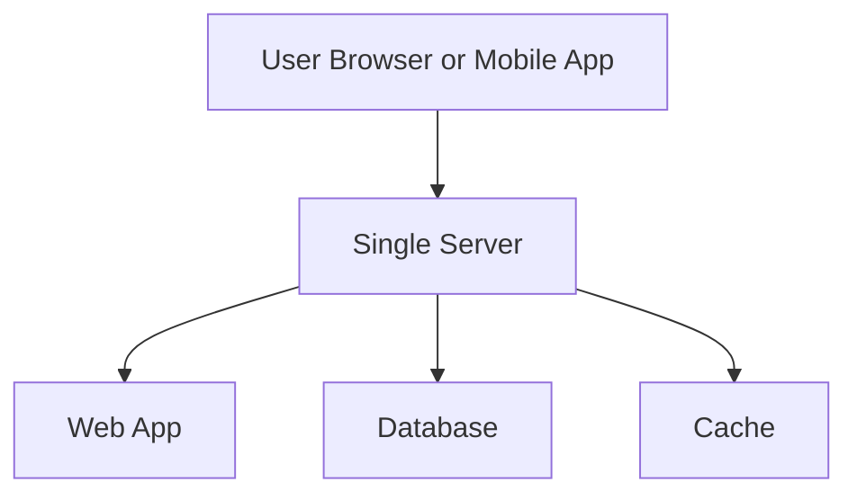

To understand this setup, it is helpful to investigate the request flow and traffic source. Let us first look at the request flow (Figure 2).

Figure 2

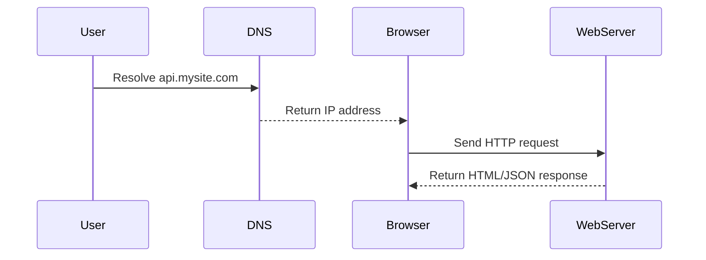
1. Users access websites through domain names, such as api.mysite.com. Usually, the Domain Name System (DNS) is a paid service provided by 3rd parties and not hosted by our servers.
2. Internet Protocol (IP) address is returned to the browser or mobile app. In the example, IP address 15.125.23.214 is returned.
3. Once the IP address is obtained, Hypertext Transfer Protocol (HTTP) [1] requests are sent directly to your web server.
4. The web server returns HTML pages or JSON response for rendering.
### Traffic sources
The traffic to your web server comes from two sources:
- **Web application**: uses server-side languages (Java, Python, etc.) for business logic and client-side languages (HTML, JavaScript) for presentation.
- **Mobile application**: communicates using HTTP and often transfers data via JSON.

An example API response in JSON format is shown below:
GET /users/12 – Retrieve user object for id = 12
{
   "id":12,
   "firstName":"John",
   "lastName":"Smith",
   "address":{
      "streetAddress":"21 2nd Street",
      "city":"New York",
      "state":"NY",
      "postalCode":10021
   },
   "phoneNumbers":[
      "212 555-1234",
      "646 555-4567"
   ]
}

## Database
With growth, one server is not enough. We need multiple servers — one for web/mobile traffic and another for the database (Figure 3). Separating the web tier and data tier allows them to scale independently.

Figure 3

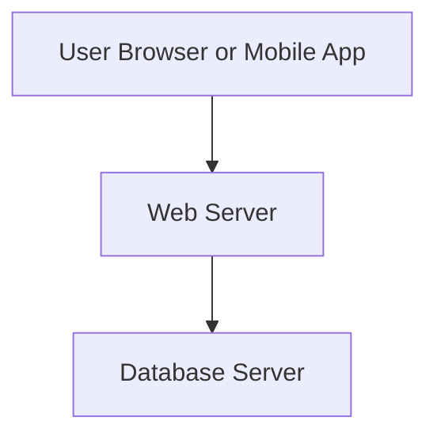

### Which databases to use?
Compare the two main options:

**Relational databases (SQL)**
- Examples: MySQL, PostgreSQL, Oracle
- Data stored in tables and rows
- Strong support for joins, transactions, and structured schemas

**Non-relational databases (NoSQL)**
- Examples: DynamoDB, Cassandra, MongoDB, Neo4j
- Includes key-value, document, column, and graph stores
- Often faster for unstructured data and massive scale

**When to choose NoSQL**
- Super-low latency is required
- Data is unstructured or schemaless
- You only need serialization and deserialization (JSON, XML, YAML)
- You need to store massive amounts of data
## Vertical scaling vs horizontal scaling

**Vertical scaling (scale up)**
- Add more CPU, RAM, or disk to one server
- Good for low traffic and simple setups
- Not unlimited: hardware limits apply
- No built-in redundancy or failover

**Horizontal scaling (scale out)**
- Add more servers to the pool
- Better for high traffic and large applications
- Offers redundancy and availability

> When a single web server fails or becomes overloaded, users can lose access. A load balancer solves this problem by spreading traffic across multiple servers.
## Load balancer
A load balancer evenly distributes incoming traffic among multiple web servers. This adds redundancy and improves availability.

Figure 4

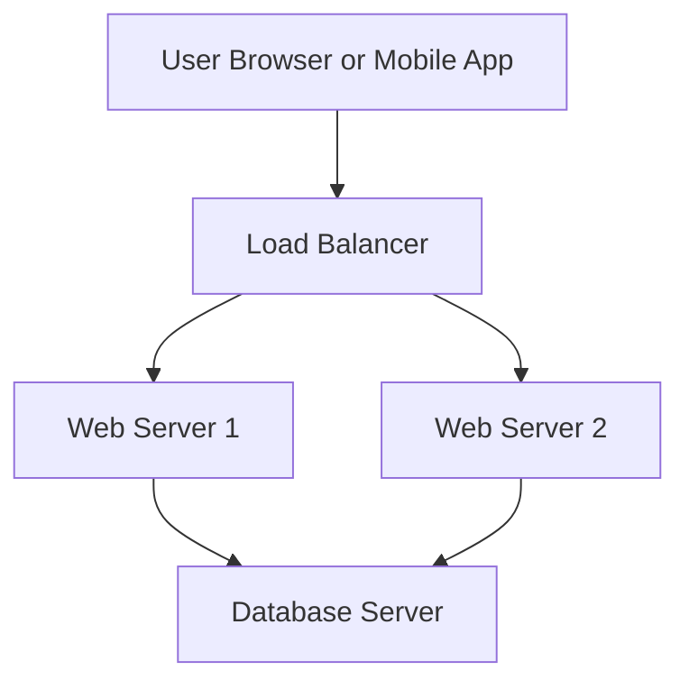

As shown in Figure 4, users connect to the public IP of the load balancer directly. With this setup, web servers are unreachable directly by clients anymore. For better security, private IPs are used for communication between servers. A private IP is an IP address reachable only between servers in the same network; however, it is unreachable over the internet. The load balancer communicates with web servers through private IPs.
In Figure 4, after a load balancer and a second web server are added, we successfully solved no failover issue and improved the availability of the web tier. Details are explained below:
If server 1 goes offline, all the traffic will be routed to server 2. This prevents the website from going offline. We will also add a new healthy web server to the server pool to balance the load.
If the website traffic grows rapidly, and two servers are not enough to handle the traffic, the load balancer can handle this problem gracefully. You only need to add more servers to the web server pool, and the load balancer automatically starts to send requests to them.
Now the web tier looks good, what about the data tier? The current design has one database, so it does not support failover and redundancy. Database replication is a common technique to address those problems. Let us take a look.
## Database replication
Quoted from Wikipedia: “Database replication can be used in many database management systems, usually with a master/slave relationship between the original (master) and the copies (slaves)” [3].

In this model:
- **Master** handles writes, inserts, updates, and deletes.
- **Slave** replicas handle read queries.
- Write traffic remains concentrated on the master, while reads scale horizontally.

This is useful when read traffic is much higher than write traffic. Figure 5 shows a master database with multiple slave databases.

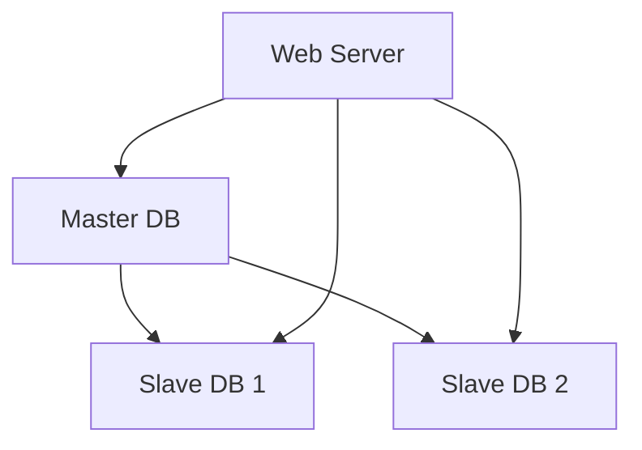

Advantages of database replication:
Better performance: In the master-slave model, all writes and updates happen in master nodes; whereas, read operations are distributed across slave nodes. This model improves performance because it allows more queries to be processed in parallel.
Reliability: If one of your database servers is destroyed by a natural disaster, such as a typhoon or an earthquake, data is still preserved. You do not need to worry about data loss because data is replicated across multiple locations.
High availability: By replicating data across different locations, your website remains in operation even if a database is offline as you can access data stored in another database server.
In the previous section, we discussed how a load balancer helped to improve system availability. We ask the same question here: what if one of the databases goes offline? The architectural design discussed in Figure 5 can handle this case:
If only one slave database is available and it goes offline, read operations will be directed to the master database temporarily. As soon as the issue is found, a new slave database will replace the old one. In case multiple slave databases are available, read operations are redirected to other healthy slave databases. A new database server will replace the old one.
If the master database goes offline, a slave database will be promoted to be the new master. All the database operations will be temporarily executed on the new master database. A new slave database will replace the old one for data replication immediately. In production systems, promoting a new master is more complicated as the data in a slave database might not be up to date. The missing data needs to be updated by running data recovery scripts. Although some other replication methods like multi-masters and circular replication could help, those setups are more complicated; and their discussions are beyond the scope of this course. Interested readers should refer to the listed reference materials [4] [5].
Figure 6 shows the system design after adding the load balancer and database replication.

Let us take a look at the design:
A user gets the IP address of the load balancer from DNS.
A user connects the load balancer with this IP address.
The HTTP request is routed to either Server 1 or Server 2.
A web server reads user data from a slave database.
A web server routes any data-modifying operations to the master database. This includes write, update, and delete operations.
Now, you have a solid understanding of the web and data tiers, it is time to improve the load/response time. This can be done by adding a cache layer and shifting static content (JavaScript/CSS/image/video files) to the content delivery network (CDN).
## Cache
A cache stores expensive or frequently accessed data in memory so that future requests are answered faster. Without cache, every page load can cause one or more database calls, which slows performance.

### Cache tier
The cache tier is much faster than the database. It improves system performance, reduces database workload, and can scale independently. Figure 7 shows a possible cache setup:

Figure 7

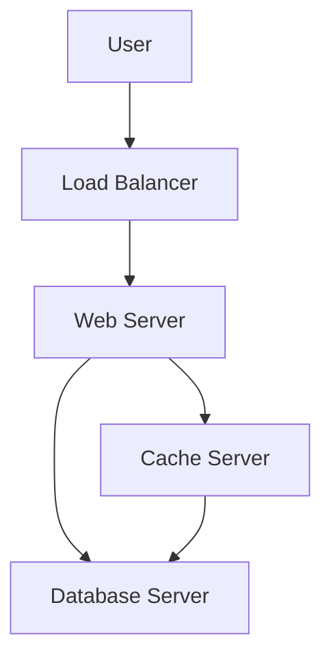

After receiving a request, a web server first checks the cache. If the response exists, it returns it immediately. Otherwise, the server queries the database, writes the result to the cache, and then returns the response. This is called a **read-through cache**.

Interacting with cache servers is simple. Most caches provide standard APIs for common languages. Example Memcached pseudo-code:
```text
SECONDS = 1
cache.set('myKey', 'hi there', 3600 * SECONDS)
cache.get('myKey')
```

### Considerations for using cache
- **When to cache:** data that is read frequently and updated infrequently.
- **Volatility:** cache is not persistent. If the cache server restarts, cached data is lost.
- **Expiration policy:** set a TTL to avoid stale data, but not too short or too long.
- **Consistency:** keeping cache and database in sync can be hard, especially across regions.
- **Failure mitigation:** avoid a single cache server SPOF by using multiple cache nodes and overprovisioning memory.

Figure 8

**Eviction policy:** when the cache is full, items are removed by policies such as LRU (least-recently-used), LFU (least-frequently-used), or FIFO.
## Content delivery network (CDN)
A CDN is a network of geographically dispersed servers used to deliver static content such as images, videos, CSS, and JavaScript.

> This chapter focuses on CDN for static content. Dynamic content caching is more advanced and beyond the current scope.

### How CDN works
- User requests a static asset.
- The nearest CDN edge server serves the asset if cached.
- If missing, the CDN fetches it from the origin server.
- The asset is cached at the edge for a TTL period.
- Subsequent requests are served from the CDN cache.

Figure 9

Figure 10 demonstrates the CDN workflow.

Figure 10

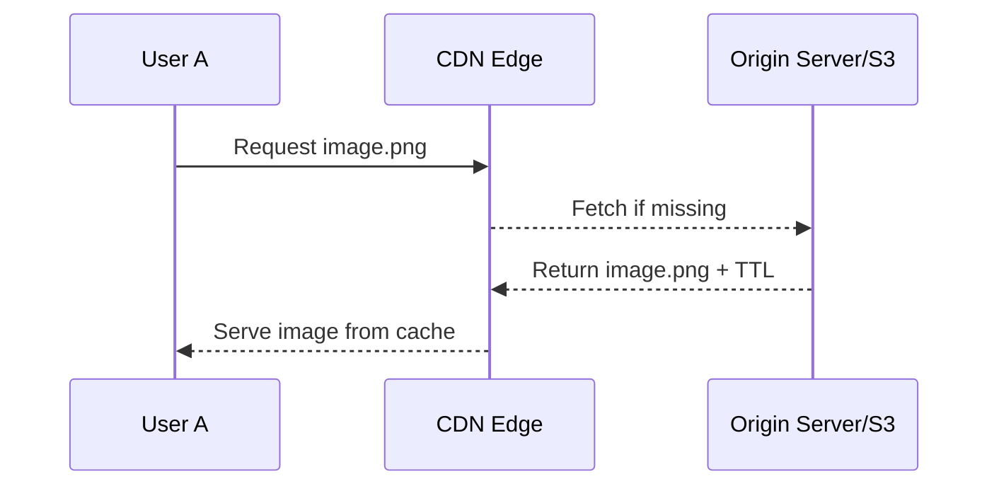

1. User A tries to get image.png by using an image URL. The URL’s domain is provided by the CDN provider. The following two image URLs are samples used to demonstrate what image URLs look like on Amazon and Akamai CDNs:
https://mysite.cloudfront.net/logo.jpg
https://mysite.akamai.com/image-manager/img/logo.jpg
2. If the CDN server does not have image.png in the cache, the CDN server requests the file from the origin, which can be a web server or online storage like Amazon S3.
3. The origin returns image.png to the CDN server, which includes optional HTTP header Time-to-Live (TTL) which describes how long the image is cached.
4. The CDN caches the image and returns it to User A. The image remains cached in the CDN until the TTL expires.
5. User B sends a request to get the same image.
6. The image is returned from the cache as long as the TTL has not expired.
### Considerations for using a CDN
- **Cost:** CDNs charge for data transfer. Avoid caching rarely used assets.
- **Cache expiry:** TTL should balance freshness and efficiency.
- **Fallback:** plan for CDN outages by allowing clients to fetch from the origin if needed.
- **Invalidation:** remove stale assets using CDN invalidation APIs or URL versioning (for example: `image.png?v=2`).

Figure 11 shows the design after CDN and cache are added.

Figure 11

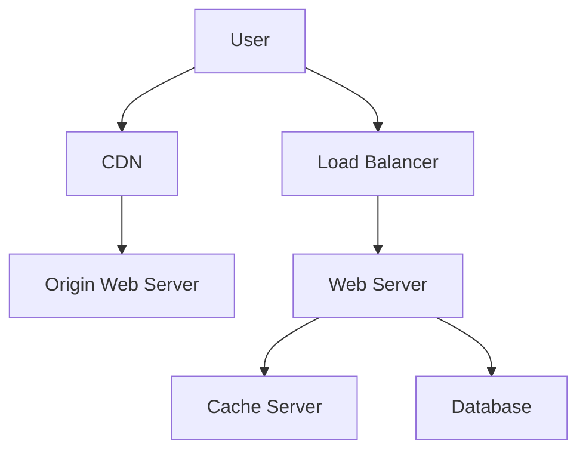

1. Static assets (JS, CSS, images, etc.,) are no longer served by web servers. They are fetched from the CDN for better performance.
2. The database load is lightened by caching data.

## Stateless web tier
To scale the web tier horizontally, remove state from individual web servers. Store session data in a shared persistent store such as a database, Redis, or NoSQL.

### Stateful architecture
A stateful server keeps client state locally between requests. This requires sticky sessions and makes scaling harder.
Figure 12 shows a stateful architecture.
Figure 12

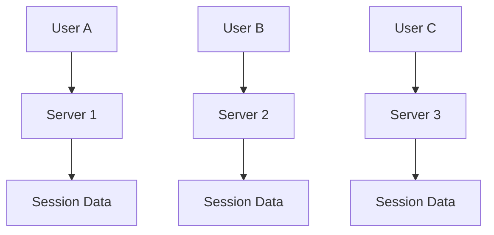

In Figure 12, user A’s session data and profile image are stored in Server 1. To authenticate User A, HTTP requests must be routed to Server 1. If a request is sent to other servers like Server 2, authentication would fail because Server 2 does not contain User A’s session data. Similarly, all HTTP requests from User B must be routed to Server 2; all requests from User C must be sent to Server 3.
The issue is that every request from the same client must be routed to the same server. This can be done with sticky sessions in most load balancers [10]; however, this adds the overhead. Adding or removing servers is much more difficult with this approach. It is also challenging to handle server failures.
### Stateless architecture
Figure 13 shows the stateless architecture.

Figure 13

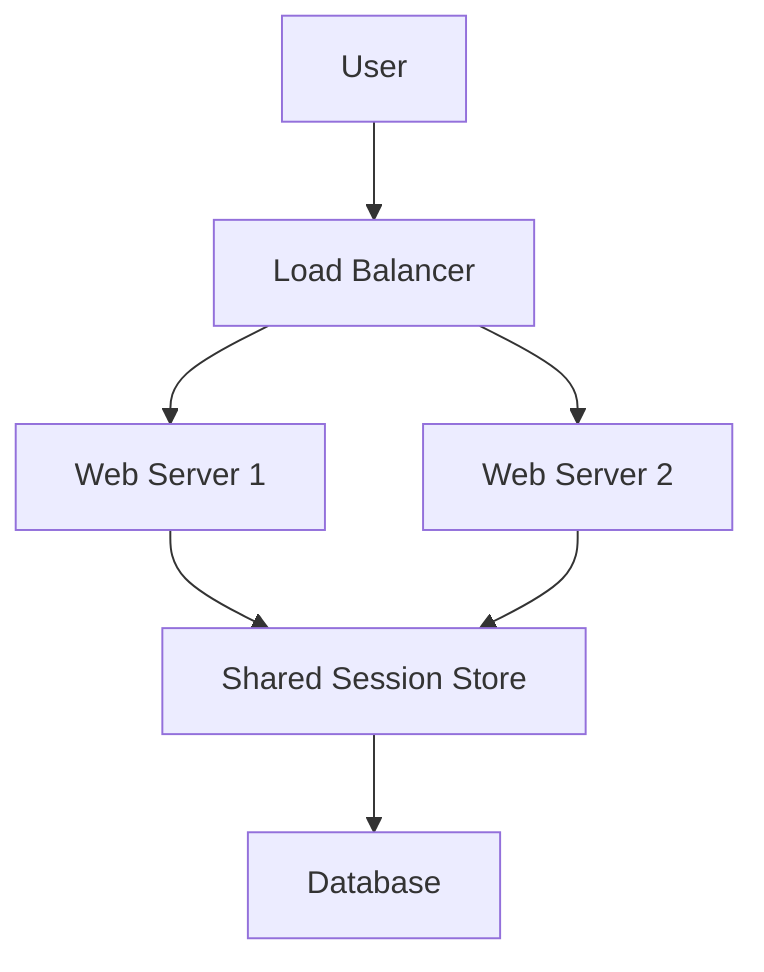

In this stateless architecture, HTTP requests from users can be sent to any web server, which fetches state data from a shared data store. State data is stored in a shared data store and kept out of web servers. A stateless system is simpler, more robust, and scalable.
Figure 14 shows the updated design with a stateless web tier.

Figure 14
In Figure 14, we move the session data out of the web tier and store them in the persistent data store. The shared data store could be a relational database, Memcached/Redis, NoSQL, etc. The NoSQL data store is chosen as it is easy to scale. Autoscaling means adding or removing web servers automatically based on the traffic load. After the state data is removed from web servers, auto-scaling of the web tier is easily achieved by adding or removing servers based on traffic load.
Your website grows rapidly and attracts a significant number of users internationally. To improve availability and provide a better user experience across wider geographical areas, supporting multiple data centers is crucial.
## Data centers
Figure 15 shows an example setup with two data centers. In normal operation, users are geoDNS-routed to the closest data center, with a split such as x% in US-East and (100 – x)% in US-West.

GeoDNS resolves domain names based on user location, improving performance and availability.

Figure 15

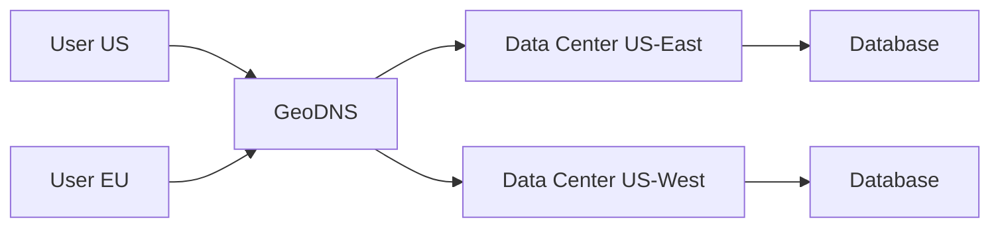

In the event of any significant data center outage, we direct all traffic to a healthy data center. In Figure 16, data center 2 (US-West) is offline, and 100% of the traffic is routed to data center 1 (US-East).

Figure 16
Several technical challenges must be resolved to achieve multi-data center setup:
Traffic redirection: Effective tools are needed to direct traffic to the correct data center. GeoDNS can be used to direct traffic to the nearest data center depending on where a user is located.
Data synchronization: Users from different regions could use different local databases or caches. In failover cases, traffic might be routed to a data center where data is unavailable. A common strategy is to replicate data across multiple data centers. A previous study shows how Netflix implements asynchronous multi-data center replication [11].
Test and deployment: With multi-data center setup, it is important to test your website/application at different locations. Automated deployment tools are vital to keep services consistent through all the data centers [11].
To further scale our system, we need to decouple different components of the system so they can be scaled independently. Messaging queue is a key strategy employed by many real-world distributed systems to solve this problem.
## Message queue
A message queue is a durable buffer that supports asynchronous communication between services.

Producers publish messages to the queue, and consumers read them when they are ready. This decouples systems and improves reliability. Figure 17 shows the basic message queue architecture.

Figure 17

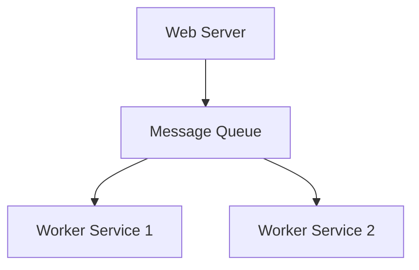

Decoupling makes the message queue a preferred architecture for building a scalable and reliable application. With the message queue, the producer can post a message to the queue when the consumer is unavailable to process it. The consumer can read messages from the queue even when the producer is unavailable.
Consider the following use case: your application supports photo customization, including cropping, sharpening, blurring, etc. Those customization tasks take time to complete. In Figure 18, web servers publish photo processing jobs to the message queue. Photo processing workers pick up jobs from the message queue and asynchronously perform photo customization tasks. The producer and the consumer can be scaled independently. When the size of the queue becomes large, more workers are added to reduce the processing time. However, if the queue is empty most of the time, the number of workers can be reduced.

Figure 18
## Logging, metrics, automation
When a site is small, logging and monitoring are optional. At scale, they become essential.

**Logging:** centralize error logs and search them easily.
**Metrics:** track performance, traffic, and resource usage.
**Automation:** use CI/CD to deploy reliably and quickly.
Logging: Monitoring error logs is important because it helps to identify errors and problems in the system. You can monitor error logs at per server level or use tools to aggregate them to a centralized service for easy search and viewing.
Metrics: Collecting different types of metrics help us to gain business insights and understand the health status of the system. Some of the following metrics are useful:
Host level metrics: CPU, Memory, disk I/O, etc.
Aggregated level metrics: for example, the performance of the entire database tier, cache tier, etc.
Key business metrics: daily active users, retention, revenue, etc.
Automation: When a system gets big and complex, we need to build or leverage automation tools to improve productivity. Continuous integration is a good practice, in which each code check-in is verified through automation, allowing teams to detect problems early. Besides, automating your build, test, deploy process, etc. could improve developer productivity significantly.
## Adding message queues and different tools
Figure 19 shows the updated design. Due to space constraints, only one data center is shown.

Key improvements:
1. Added a message queue for loose coupling and resilience.
2. Included logging, monitoring, metrics, and automation tools.

Figure 19

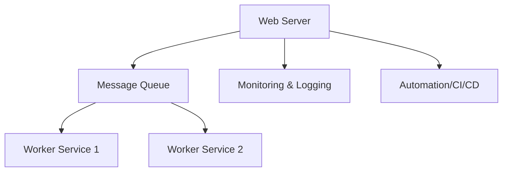

As data grows every day, the database may become overloaded. It is time to scale the data tier.

## Database scaling
There are two broad approaches to database scaling: vertical scaling and horizontal scaling.

### Vertical scaling
Vertical scaling, or scaling up, means adding more power (CPU, RAM, disk) to a single machine. For example, some database servers can have very large memory footprints.

Drawbacks:
- Hardware limits exist.
- Single point of failure remains.
- Cost is high for very powerful machines.

### Horizontal scaling
Horizontal scaling, also known as sharding, means adding more database servers.
Figure 20 compares vertical scale vs horizontal scale.

Figure 20

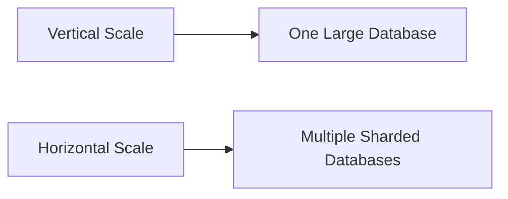

Sharding separates large databases into smaller, more easily managed parts called shards. Each shard shares the same schema, though the actual data on each shard is unique to the shard.
Figure 21 shows an example of sharded databases. User data is allocated to a database server based on user IDs. Anytime you access data, a hash function is used to find the corresponding shard. In our example, user_id % 4 is used as the hash function. If the result equals to 0, shard 0 is used to store and fetch data. If the result equals to 1, shard 1 is used. The same logic applies to other shards.

Figure 21

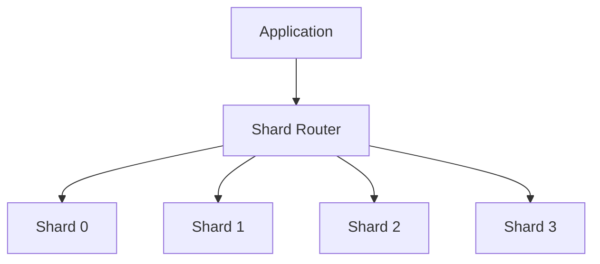

Figure 22 shows the user table in sharded databases.

Figure 22
The most important factor to consider when implementing a sharding strategy is the choice of the sharding key. A sharding key (known as a partition key) consists of one or more columns that determine how data is distributed. As shown in Figure 22, “user_id” is the sharding key. A sharding key allows you to retrieve and modify data efficiently by routing database queries to the correct database. When choosing a sharding key, one of the most important criteria is to choose a key that can evenly distribute data.

Sharding is a great technique to scale the database, but it introduces complexities and new challenges.

### Modulo-based sharding
A common approach is modulo-based sharding: `shard = user_id % 4`.

**Benefits:**
- Easy to implement
- Deterministic routing

**Drawbacks:**
- Resharding requires moving most keys
- Data movement is expensive
- Uneven distributions can create hot shards

### Consistent hashing
Consistent hashing solves resharding problems by mapping data and shards onto a hash ring.

**How it works:**
1. Hash each shard identifier to a position on the ring.
2. Hash each data key to a position on the same ring.
3. Assign the key to the first shard clockwise from the key position.

This means fewer keys move when shards change.

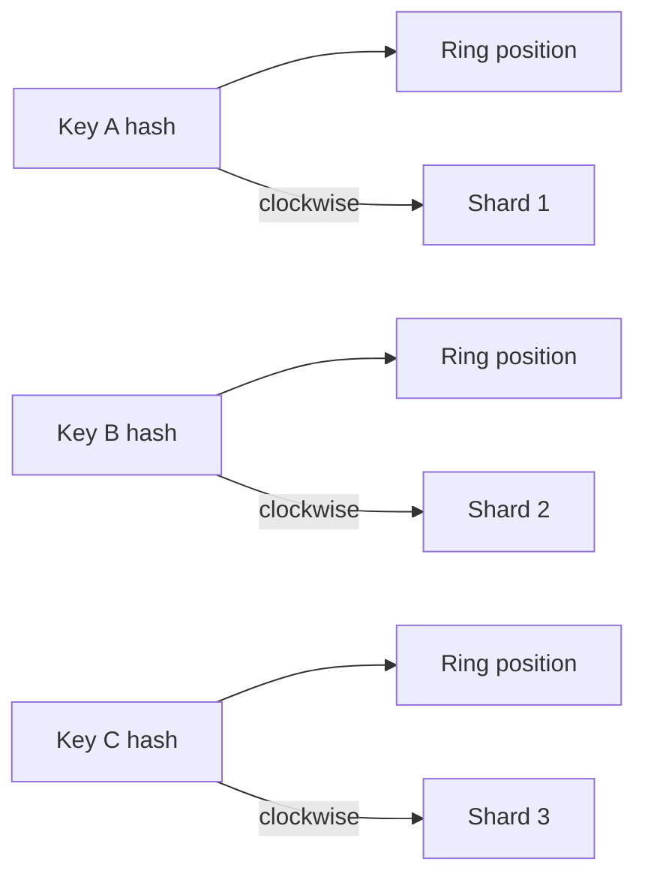

### Virtual nodes and circular hashing
A single shard node can still produce imbalance if hash positions cluster. Virtual nodes spread each physical shard across multiple ring positions.

**How virtual nodes work:**
- Each physical shard has many virtual nodes.
- Virtual nodes are given distinct hash positions, e.g. `Shard0-1`, `Shard0-2`, `Shard0-3`.
- A key maps to the next virtual node clockwise, which routes to the physical shard.

**Benefits:**
- Better balance across shards
- Smoother scaling when adding or removing shards
- Fewer hotspot issues

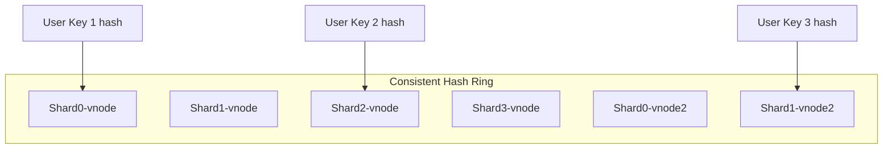

**Notes:**
- Use a strong hash function to avoid collisions.
- Tune virtual node count to the shard count and traffic pattern.
- Consistent hashing is widely used for cache clusters, storage, and sharded databases.

### Remaining challenges
- **Celebrity problem:** hot keys can overload a shard. Special handling may be needed for extremely popular items.
- **Joins and denormalization:** cross-shard joins are hard, so denormalized data is often used.

In Figure 23, we shard databases to support rapid traffic growth. Some NoSQL storage is also introduced to reduce load on the relational tier.

Figure 23

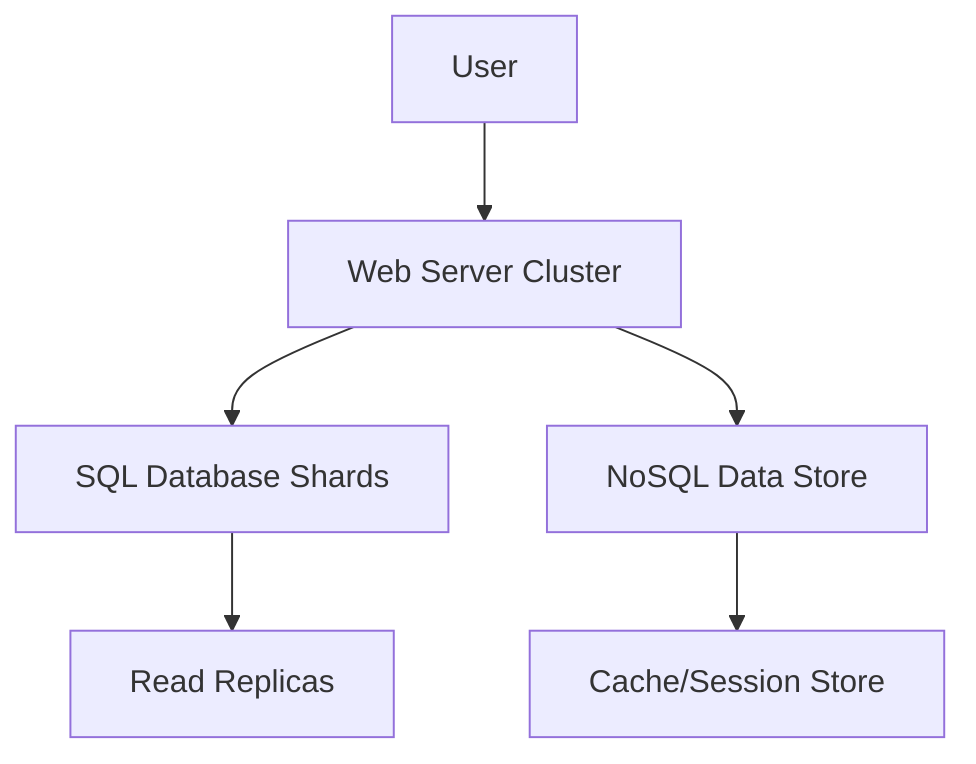

Millions of users and beyond
Scaling a system is an iterative process. Iterating on what we have learned in this chapter could get us far. More fine-tuning and new strategies are needed to scale beyond millions of users. For example, you might need to optimize your system and decouple the system to even smaller services. All the techniques learned in this chapter should provide a good foundation to tackle new challenges. To conclude this chapter, we provide a summary of how we scale our system to support millions of users:
Keep web tier stateless
Build redundancy at every tier
Cache data as much as you can
Support multiple data centers
Host static assets in CDN
Scale your data tier by sharding
Split tiers into individual services
Monitor your system and use automation tools

Reference materials
[1]Hypertext Transfer Protocol: https://en.wikipedia.org/wiki/Hypertext_Transfer_Protocol
[2] Should you go Beyond Relational Databases?:
https://blog.teamtreehouse.com/should-you-go-beyond-relational-databases
[3] Replication: https://en.wikipedia.org/wiki/Replication_(computing)
[4] Multi-master replication:
https://en.wikipedia.org/wiki/Multi-master_replication
[5] NDB Cluster Replication: Bidirectional and Circular Replication:
https://dev.mysql.com/doc/refman/8.4/en/mysql-cluster-replication-multi-source.html
[6] Caching Strategies and How to Choose the Right One:
https://codeahoy.com/2017/08/11/caching-strategies-and-how-to-choose-the-right-one/
[7] R. Nishtala etc. al., "Scaling Memcache at Facebook," 10th USENIX Symposium on Networked Systems Design and Implementation (NSDI ’13): https://www.usenix.org/system/files/conference/nsdi13/nsdi13-final170_update.pdf
[8] Single point of failure: https://en.wikipedia.org/wiki/Single_point_of_failure
[9] Amazon CloudFront Dynamic Content Delivery:
https://aws.amazon.com/cloudfront/dynamic-content/
[10] Configure Sticky Sessions for Your Classic Load Balancer:
https://docs.aws.amazon.com/elasticloadbalancing/latest/classic/elb-sticky-sessions.html
[11] Active-Active for Multi-Regional Resiliency:
https://netflixtechblog.com/active-active-for-multi-regional-resiliency-c47719f6685b
[12] Amazon EC2 High Memory Instances:
https://aws.amazon.com/ec2/instance-types/high-memory/
[13] What it takes to run Stack Overflow:
http://nickcraver.com/blog/2013/11/22/what-it-takes-to-run-stack-overflow
[14] What The Heck Are You Actually Using NoSQL For:
http://highscalability.com/blog/2010/12/6/what-the-heck-are-you-actually-using-nosql-for.html